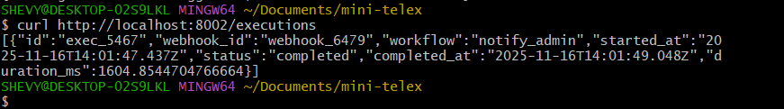

# Mini-Telex: Production-Grade Observability Implementation

> A comprehensive hands-on project demonstrating enterprise observability patterns for polyglot microservices architectur

## 🎯 Overview

**Mini-Telex** is a production-ready practice environment for implementing comprehensive observability in a microservices architecture. Built as a simplified version of a real-world messaging platform ([Telex](https://github.com/telexorg)), this project serves as a safe sandbox for learning and mastering DevOps observability patterns before applying them to production systems.

### Why This Project Exists

During my HNG13 DevOps internship, I was tasked with implementing observability for Telex - a complex platform with 37+ microservices across multiple programming languages. Rather than risk breaking production, I built this practice environment to:

1. **Learn observability fundamentals** without production risks
2. **Master the tools** (Grafana, Loki, Prometheus, Tempo)
3. **Develop implementation patterns** for polyglot architectures
4. **Create reusable configurations** for production deployment
5. **Build a portfolio piece** demonstrating real DevOps skills


## 🎯 Project Goals

### Primary Objectives

- ✅ **Phase 1:** Centralized log aggregation across all services
- 🚧 **Phase 2:** Metrics collection and visualization
- 📋 **Phase 3:** Distributed tracing implementation
- 📋 **Phase 4:** Alerting and incident response
- 📋 **Phase 5:** Production readiness (dashboards, runbooks, documentation)

### Success Metrics

**Before Implementation:**
- ❌ Zero visibility into service health
- ❌ Scattered logs across containers
- ❌ Manual debugging required
- ❌ No error tracking
- ❌ Unknown performance characteristics

**After Phase 1 (Current):**
- ✅ 100% log coverage across services
- ✅ Centralized log viewing in Grafana
- ✅ Real-time error detection
- ✅ Cross-service log correlation
- ✅ Searchable log history (7 days retention)

**Target (Phase 5):**
- ✅ Full observability: Logs + Metrics + Traces
- ✅ Automated alerting to Slack
- ✅ Performance dashboards
- ✅ Sub-second MTTR (Mean Time To Resolution)
- ✅ Production-ready configuration


## 🏗️ Architecture

### System Overview

Mini-Telex consists of three microservices representing a messaging platform:

```
┌─────────────────────────────────────────────────────────┐
│                   GRAFANA DASHBOARD                     │
│          (Unified Observability Interface)              │
│    Logs | Metrics | Traces | Alerts | Dashboards        │
└───────────────┬─────────────────────────────────────────┘
                │
       ┌────────┴─────────┐
       │                  │
   ┌───▼────┐      ┌─────▼──────┐      ┌──────────┐
   │  LOKI  │      │PROMETHEUS  │      │  TEMPO   │
   │ (Logs) │      │ (Metrics)  │      │(Traces)  │
   └───▲────┘      └─────▲──────┘      └────▲─────┘
       │                │                   │
   ┌───┴────┐           │                   │
   │PROMTAIL│           │                   │
   │(Collect)│          │                   │
   └───▲────┘           │                   │
       │                │                   │
┌──────┴────────────────┴───────────────────┴──────┐
│           MICROSERVICES LAYER                    │
├──────────────────────────────────────────────────┤
│  ┌─────────────┐  ┌─────────────┐  ┌──────────┐  │
│  │ API Service │  │   Worker    │  │ Webhook  │  │
│  │  (Golang)   │  │  Service    │  │ Service  │  │
│  │   :8000     │  │  (Python)   │  │ (Node.js)│  │
│  │             │  │   :8001     │  │  :8002   │  │
│  └─────────────┘  └─────────────┘  └──────────┘  │
└──────────────────────────────────────────────────┘
```

### Component Responsibilities

#### Application Layer

| Service | Technology | Port | Purpose | Key Features |
|---------|------------|------|---------|--------------|
| **API Service** | Go 1.21 | 8000 | REST API | User management, message handling, health checks |
| **Worker Service** | Python 3.11 | 8001 | Background Jobs | Async task processing, job queue management |
| **Webhook Service** | Node.js 18 | 8002 | Webhooks | Workflow execution, event handling |

#### Observability Layer

| Component | Port | Purpose | Status |
|-----------|------|---------|--------|
| **Grafana** | 3001 | Visualization dashboard | ✅ Configured |
| **Loki** | 3100 | Log aggregation | ✅ Active |
| **Promtail** | 9080 | Log collection | ✅ Active |
| **Prometheus** | 9090 | Metrics storage | 🚧 Setup |
| **Tempo** | 3200 | Distributed tracing | 📋 Planned |


## 🛠️ Technology Stack

### Application Services

```yaml
Languages:
  - Golang 1.21      # High-performance API layer
  - Python 3.11      # Data processing & ML workloads
  - Node.js 18       # Real-time webhooks & async tasks

Frameworks:
  - Go: net/http (stdlib)
  - Python: Flask 3.0
  - Node.js: Express 4.18
```

### Observability Stack

```yaml
Logging:
  - Grafana Loki 2.9.3     # Log aggregation
  - Promtail 2.9.3         # Log shipping
  
Metrics:
  - Prometheus 2.48        # Time-series database
  - Client Libraries:
      - Go: prometheus/client_golang
      - Python: prometheus_client
      - Node.js: prom-client

Tracing:
  - Grafana Tempo 2.3      # Distributed tracing
  - OpenTelemetry SDKs     # Instrumentation

Visualization:
  - Grafana 10.2           # Unified dashboard
  
Alerting:
  - Alertmanager 0.26      # Alert routing
  - Slack Integration      # Notifications
```

### Infrastructure

```
Containerization: Docker 24.x
Orchestration: Docker Compose 3.8
Operating System: Windows 11 (WSL2 backend)
```

## 🚀 Getting Started

### Prerequisites

Before you begin, ensure you have:

- ✅ **Docker Desktop** (version 24.x or higher)
  - [Download for Windows](https://docs.docker.com/desktop/install/windows-install/)
  - Enable WSL2 backend for better performance
- ✅ **Git** (version 2.x or higher)
- ✅ **8GB RAM minimum** (16GB recommended)
- ✅ **Available Ports:** 8000-8002, 3001, 3100, 9090
- ✅ **Disk Space:** 10GB free for Docker volumes


### Quick Start (5 minutes)

```
# 1. Clone the repository
git clone https://github.com/YOUR_USERNAME/mini-telex-observability.git
cd mini-telex-observability

# 2. Start all services
docker-compose up -d

# 3. Wait for services to initialize (~30 seconds)
docker-compose ps

# 4. Verify health
curl http://localhost:8000/health  # API Service
curl http://localhost:8001/health  # Worker Service
curl http://localhost:8002/health  # Webhook Service
curl http://localhost:3100/ready   # Loki

# 5. Access Grafana
# Open browser: http://localhost:3001
# Login: admin / admin
```


### Initial Setup

After starting services:

1. **Access Grafana:** http://localhost:3001
2. **Login credentials:** 
   - Username: `admin`
   - Password: `admin`
3. **Skip password change** (optional for learning environment)
4. Navigate to **Explore** to start viewing logs


## 📚 Services Documentation

### 1. API Service (Golang)

**Purpose:** Primary REST API handling user and message operations

#### Endpoints

| Method | Endpoint | Description | Example |
|--------|----------|-------------|---------|
| GET | `/health` | Health check | `curl http://localhost:8000/health` |
| GET | `/api/users` | List all users | `curl http://localhost:8000/api/users` |
| POST | `/api/users` | Create new user | See below |
| GET | `/api/messages` | List all messages | `curl http://localhost:8000/api/messages` |
| POST | `/api/messages` | Create message | See below |
| GET | `/api/chaos?action=X` | Chaos testing | `action=error\|slow\|crash` |

#### Example Requests

**Create User:**
```
curl -X POST http://localhost:8000/api/users \
  -H "Content-Type: application/json" \
  -d '{
    "name": "John Doe"
  }'
```

**Create Message:**
```
curl -X POST http://localhost:8000/api/messages \
  -H "Content-Type: application/json" \
  -d '{
    "user_id": "user_123",
    "content": "Hello, World!"
  }'
```

**Note:** 10% of messages fail randomly to simulate real-world errors.

**[📸 INSERT: API service logs in Grafana]**
*Location: `docs/images/api-service-logs.png`*

---

### 2. Worker Service (Python)

**Purpose:** Background job processing and queue management

#### Endpoints

| Method | Endpoint | Description | Example |
|--------|----------|-------------|---------|
| GET | `/health` | Health check | `curl http://localhost:8001/health` |
| GET | `/jobs` | List all jobs | `curl http://localhost:8001/jobs` |
| POST | `/jobs` | Queue new job | See below |
| POST | `/jobs/process` | Process next job | `curl -X POST http://localhost:8001/jobs/process` |
| GET | `/jobs/stats` | Job statistics | `curl http://localhost:8001/jobs/stats` |

#### Example Requests

**Queue Job:**
```
curl -X POST http://localhost:8001/jobs \
  -H "Content-Type: application/json" \
  -d '{
    "type": "send_email",
    "data": {
      "to": "user@example.com",
      "subject": "Welcome!"
    }
  }'
```


**Process Job:**
```
curl -X POST http://localhost:8001/jobs/process
```

**Note:** 15% of jobs fail randomly to simulate processing errors.


### 3. Webhook Service (Node.js)

**Purpose:** Webhook management and workflow execution

#### Endpoints

| Method | Endpoint | Description | Example |
|--------|----------|-------------|---------|
| GET | `/health` | Health check | `curl http://localhost:8002/health` |
| GET | `/webhooks` | List webhooks | `curl http://localhost:8002/webhooks` |
| POST | `/webhooks` | Create webhook | See below |
| POST | `/webhooks/:id/trigger` | Trigger workflow | See below |
| GET | `/executions` | List executions | `curl http://localhost:8002/executions` |
| GET | `/executions/stats` | Execution stats | `curl http://localhost:8002/executions/stats` |

#### Example Requests

**Create Webhook:**
```
curl -X POST http://localhost:8002/webhooks \
  -H "Content-Type: application/json" \
  -d '{
    "name": "User Created",
    "workflow": "notify_admin"
  }'
```


**Trigger Webhook:**
```
# Use the webhook ID from the creation response
curl -X POST http://localhost:8002/webhooks/webhook_6479/trigger
```


---

## 📊 Observability Implementation

### Phase 1: Centralized Logging ✅ COMPLETE

#### What Was Implemented

**Infrastructure:**
- Grafana Loki for log storage and indexing
- Promtail for automatic log collection from Docker containers
- Grafana for log visualization and exploration

**Configuration:**
- Docker label-based log collection
- 7-day log retention policy
- Service-based log filtering
- Log level extraction and labeling


#### How It Works

```
┌──────────────┐
│  Container   │ → Outputs logs to stdout
│ (api-service)│
└──────┬───────┘
       │
       ▼
┌──────────────┐
│  Docker      │ → Stores logs in JSON files
│  Log Driver  │
└──────┬───────┘
       │
       ▼
┌──────────────┐
│  Promtail    │ → Reads logs via Docker socket
│              │ → Adds labels (service, level)
└──────┬───────┘
       │
       ▼
┌──────────────┐
│    Loki      │ → Stores and indexes logs
│              │ → Provides query interface
└──────┬───────┘
       │
       ▼
┌──────────────┐
│   Grafana    │ → Displays logs to user
│              │ → Provides search and filter
└──────────────┘
```

#### Key Features

✅ **Real-time Log Streaming**
- Logs appear in Grafana within 1-2 seconds
- Live tail functionality
- Automatic scroll with new logs

✅ **Powerful Search Capabilities**
```
# All logs from API service
{service="api-service"}

# Only ERROR logs
{level="ERROR"}

# Logs containing specific text
{service=~".*"} |= "failed"

# Complex filters
{service="api-service", level="ERROR"} |= "database"
```

✅ **Cross-Service Correlation**
- View logs from multiple services simultaneously
- Filter by time range
- Compare service behavior


### Phase 2: Metrics Collection 🚧 IN PROGRESS

#### Implementation Plan

**Objectives:**
- Expose `/metrics` endpoint on each service
- Collect HTTP request metrics (rate, errors, duration)
- Track business metrics (users created, jobs processed)
- Create metric dashboards in Grafana

**Metrics to Collect:**

**HTTP Metrics:**
```
http_requests_total              # Counter: Total requests
http_request_duration_seconds    # Histogram: Request latency
http_requests_in_progress        # Gauge: Active requests
```

**Business Metrics:**
```
users_created_total              # Counter: Users created
messages_sent_total              # Counter: Messages sent
jobs_processed_total             # Counter: Jobs processed
job_duration_seconds             # Histogram: Job processing time
```

**System Metrics:**
```
container_cpu_usage              # Gauge: CPU usage %
container_memory_usage_bytes     # Gauge: Memory usage
container_network_receive_bytes  # Counter: Network in
container_network_transmit_bytes # Counter: Network out
```

**Status:** Implementation guide in `docs/PHASE2_METRICS.md`


### Phase 3: Distributed Tracing 📋 PLANNED

#### Objectives

- Implement OpenTelemetry in all services
- Deploy Grafana Tempo
- Track requests across service boundaries
- Link traces to logs and metrics

**Example Trace:**
```
Request: POST /api/messages
├─ API Service (50ms)
│  ├─ Validate input (5ms)
│  ├─ Save to database (30ms)
│  └─ Queue job (15ms)
└─ Worker Service (200ms)
   ├─ Fetch job (10ms)
   ├─ Process message (180ms)
   └─ Update status (10ms)
Total: 250ms
```

### Phase 4: Alerting 📋 PLANNED

#### Planned Alerts

| Alert | Condition | Severity | Action |
|-------|-----------|----------|--------|
| Service Down | Service unreachable > 1 min | Critical | Page on-call |
| High Error Rate | Error rate > 5% for 5 min | Warning | Slack notification |
| Slow Responses | P95 latency > 1s for 5 min | Warning | Slack notification |
| Disk Space Low | Disk < 10% free | Warning | Slack notification |

**Notification Channels:**
- Slack webhook integration
- Email (optional)
- PagerDuty (production)


## 📖 Usage Guide

### Viewing Logs in Grafana

#### Step 1: Access Grafana
1. Open browser: http://localhost:3001
2. Login: `admin` / `admin`
   


#### Step 2: Open Explore
1. Click **Explore** icon (compass) in left sidebar
2. Ensure **Loki** is selected as datasource


#### Step 3: Query Logs

**Basic Queries:**
```
# View all logs
{service=~".+"}

# Logs from specific service
{service="api-service"}

# Error logs only
{service=~".+", level="ERROR"}
```


**Advanced Queries:**
```
# Search for text
{service="api-service"} |= "user"

# Exclude patterns
{service="api-service"} != "health"

# Regex matching
{service="api-service"} |~ "error|failed"

# Rate calculations
rate({service="api-service"}[5m])
```


### Generating Test Data

#### Automated Traffic Generator

Save as `scripts/generate-traffic.sh`:

```
#!/bin/bash
# Traffic generator for Mini-Telex

echo "🚀 Generating test traffic..."

# Create users
echo "Creating users..."
for i in {1..10}; do
  curl -s -X POST http://localhost:8000/api/users \
    -H "Content-Type: application/json" \
    -d "{\"name\":\"User $i\"}" > /dev/null
  echo "  ✅ Created User $i"
  sleep 0.5
done

# Create messages
echo "Creating messages..."
for i in {1..20}; do
  curl -s -X POST http://localhost:8000/api/messages \
    -H "Content-Type: application/json" \
    -d "{\"user_id\":\"user_$i\",\"content\":\"Message $i\"}" > /dev/null
  echo "  ✅ Created Message $i"
  sleep 0.3
done

# Queue jobs
echo "Queueing jobs..."
for i in {1..5}; do
  curl -s -X POST http://localhost:8001/jobs \
    -H "Content-Type: application/json" \
    -d "{\"type\":\"send_email\",\"data\":{\"to\":\"user$i@example.com\"}}" > /dev/null
  echo "  ✅ Queued Job $i"
done

# Process jobs
echo "Processing jobs..."
for i in {1..5}; do
  curl -s -X POST http://localhost:8001/jobs/process > /dev/null
  echo "  ✅ Processed Job $i"
  sleep 1
done

echo "✅ Traffic generation complete!"
echo "📊 View logs in Grafana: http://localhost:3001"
```

Run it:
```
chmod +x scripts/generate-traffic.sh
./scripts/generate-traffic.sh
```


### Testing Error Scenarios

#### Chaos Engineering Endpoints

**Test API Service Errors:**
```
# Trigger 500 error
curl "http://localhost:8000/api/chaos?action=error"

# Trigger slow response (5 seconds)
curl "http://localhost:8000/api/chaos?action=slow"

# Trigger crash (service restarts)
curl "http://localhost:8000/api/chaos?action=crash"
```

**Test Worker Service Errors:**
```bash
# Trigger error
curl "http://localhost:8001/chaos?action=error"

# Simulate memory leak
curl "http://localhost:8001/chaos?action=memory"
```

**Then view errors in Grafana:**
```logql
{service=~".*", level="ERROR"}
```


### Creating Custom Dashboards

#### Step 1: Create New Dashboard
1. Click **+** icon (top left)
2. Select **Dashboard**
3. Click **Add visualization**


#### Step 2: Add Log Panel
1. Select **Loki** as datasource
2. Enter query: `{service="api-service"}`
3. Select visualization: **Logs**
4. Set title: "API Service Logs"
5. Click **Apply**

#### Step 3: Save Dashboard
1. Click **Save** icon (top right)
2. Name: "Mini-Telex Overview"
3. Click **Save**


## 🐛 Troubleshooting

### Common Issues

#### 1. Services Won't Start

**Symptoms:**
```bash
docker-compose up -d
# Error: port already allocated
```

**Solution:**
```bash
# Find what's using the port
netstat -ano | findstr :3001

# Kill the process
taskkill /F /PID [PID]

# Or change port in docker-compose.yml
```

#### 2. No Logs in Grafana

**Symptoms:** Grafana Explore shows no logs

**Diagnostic Steps:**

```
# 1. Check Promtail is running
docker logs mini-telex-promtail

# 2. Verify Loki is ready
curl http://localhost:3100/ready
# Should return: "ready"

# 3. Check containers have logging labels
docker inspect mini-telex-api | grep -A 5 Labels
# Should show: "logging": "promtail"

# 4. Restart Promtail
docker-compose restart promtail
```

#### 3. Grafana Won't Start

**Symptoms:**
```
Error: Bind for 0.0.0.0:3001 failed
```

**Solution:**
```
# Find and kill process using port
netstat -ano | findstr :3001
taskkill /F /PID [PID]

# Restart
docker-compose restart grafana
```

#### 4. High Memory Usage

**Symptoms:** Docker using >8GB RAM

**Solution:**
```
# Limit container memory in docker-compose.yml
services:
  api-service:
    deploy:
      resources:
        limits:
          memory: 512M
```

### Health Check Commands

```
# Check all services
docker-compose ps

# Check specific service
docker-compose logs api-service

# Follow logs in real-time
docker-compose logs -f

# Check resource usage
docker stats

# Restart all services
docker-compose restart

# Full reset
docker-compose down
docker-compose up -d --build
```


### Challenges Overcome

**Challenge 1: Port Conflicts**
- **Problem:** Grafana wouldn't start on port 3000
- **Root Cause:** Zombie Docker process holding port
- **Solution:** Changed to port 3001, documented troubleshooting steps
- **Learning:** Always have flexible port configuration

**Challenge 2: Logs Not Appearing**
- **Problem:** Grafana showed no logs initially
- **Root Cause:** Missing Docker labels for Promtail filtering
- **Solution:** Added `logging: promtail` labels to all services
- **Learning:** Label-based service discovery is powerful

**Challenge 3: Understanding Log Queries**
- **Problem:** LogQL syntax was confusing
- **Root Cause:** Never used query languages before
- **Solution:** Started with simple queries, gradually added complexity
- **Learning:** Hands-on practice beats reading documentation


## 💡 What I Learned

### Technical Skills

#### Observability Architecture
- ✅ **Log Aggregation:** How Loki differs from ELK (lighter, simpler)
- ✅ **Log Shipping:** Promtail's push-based vs Fluentd's pull model
- ✅ **Query Languages:** LogQL for log searching and filtering
- ✅ **Label-based Filtering:** Service discovery via Docker labels

#### Docker & Containers
- ✅ **Multi-Container Orchestration:** Docker Compose patterns
- ✅ **Networking:** Container-to-container communication
- ✅ **Volume Management:** Persistent data storage
- ✅ **Health Checks:** Container health monitoring

#### Grafana Configuration
- ✅ **Datasource Provisioning:** Auto-configuration via YAML
- ✅ **Dashboard Creation:** Panel types and queries
- ✅ **Explore Interface:** Ad-hoc log exploration
- ✅ **User Management:** Authentication and authorization

#### Polyglot Microservices
- ✅ **Golang:** HTTP servers, JSON handling
- ✅ **Python:** Flask APIs, background workers
- ✅ **Node.js:** Express routing, async operations

### Soft Skills

- ✅ **Problem Decomposition:** Breaking complex problems into phases
- ✅ **Risk Management:** Testing in sandbox before production
- ✅ **Documentation:** Writing clear, actionable guides
- ✅ **Communication:** Explaining technical concepts simply

### Production-Ready Patterns

**Learned:**
1. **Never modify production without testing locally**
2. **Document everything as you build**
3. **Use meaningful labels and names**
4. **Implement chaos testing early**
5. **Build observability into the design, not as an afterthought**

---

## 🗺️ Roadmap

### Phase 2: Metrics Collection (Current) 🚧

**Timeline:** 3-4 days  
**Status:** In Planning

**Objectives:**
- [ ] Add Prometheus client libraries to all services
- [ ] Expose `/metrics` endpoints
- [ ] Configure Prometheus scraping
- [ ] Create metric dashboards (request rate, error rate, latency)
- [ ] Implement business metrics

**Deliverables:**
- Code changes for each service
- Prometheus configuration
- 3-5 metric dashboards
- Documentation: `docs/PHASE2_METRICS.md`


---

### Phase 3: Structured Logging (Next) 📋

**Timeline:** 2-3 days  
**Status:** Planned

**Objectives:**
- [ ] Convert logs to JSON format
- [ ] Add trace IDs for request correlation
- [ ] Implement structured fields (user_id, request_id, duration)
- [ ] Improve Promtail parsing

**Example:**
```json
{
  "timestamp": "